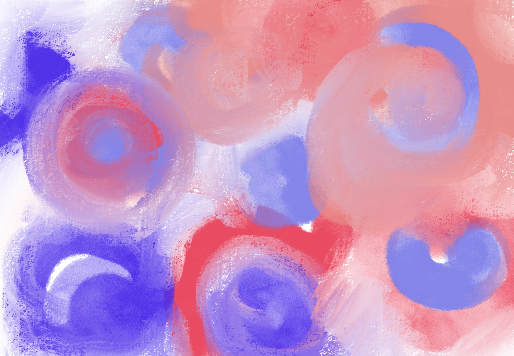
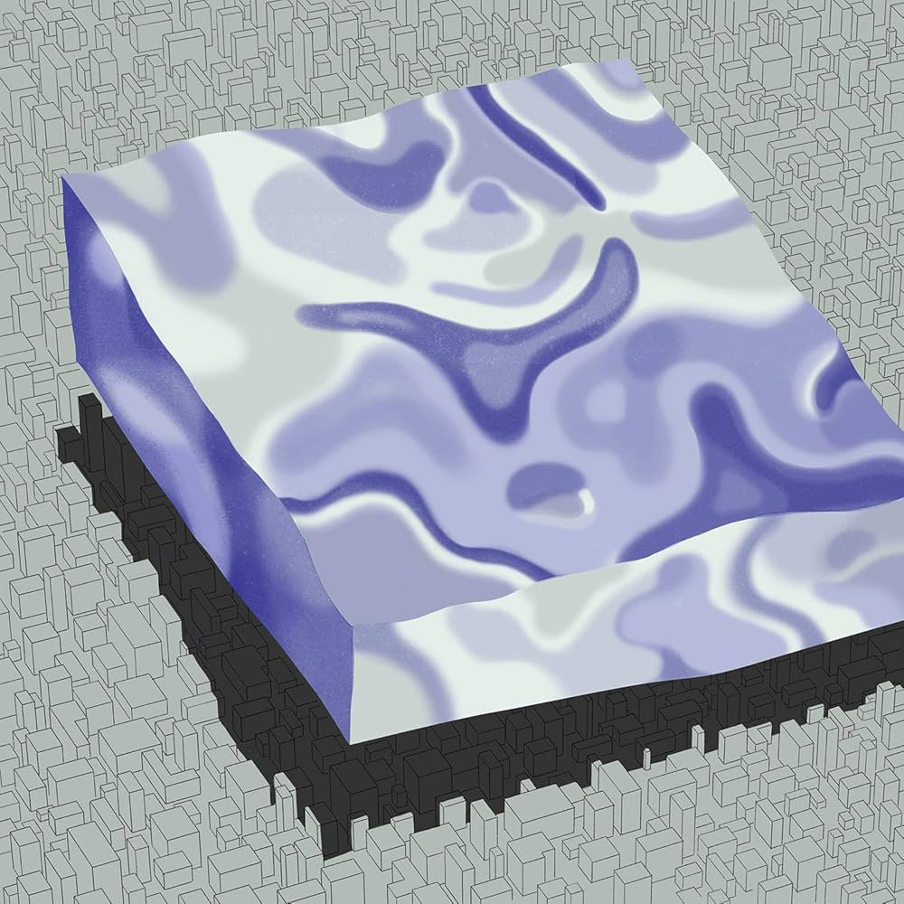

# Midterm

##### What book, album or movie did you choose? What is it about?
The album's name is inspired by the novel of the same name by Italian writer Italo Calvino. It reflects the band members' thoughts on young people leaving Dalian (a typical Nothern Chinese City)and their complex emotions towards the city. This album is warm-toned, using instrumental music to depict Dalian.

##### What aspect of the Album will you include in your cover?
Dalian is a coastal city, yet it embodies the characteristics of a typical northern Chinese city where experiencing industry recession. As people leave, the city becomes a fading memory in the minds of the young. Therefore, with this midterm project, I aim to capture a sense of warmth and nostalgia—something that is lost and elusive, yet deeply felt.

##### Is it interactive? time-based? both?
Based on my current vision, I hope it can be both. With each click, it will ripple in the direction of the thought. Over time, different abstract colors and shapes will alternate and change. At the same time, I also want to continue the feel of the original album cover—dreamy, damp, and warm.

##### What ideas would you like to explore or experiment with?
I want to experiment with high-noise visual effects, the merging of different colors, and the treatment of organic forms.

##### Are there aspects of your project that are related to any of the readings we’ve done?
I am deeply inspired by concept art and related readings. I appreciate how they capture concepts without strictly defining their meanings. This aligns with the post-rock approach to emotional expression, which emphasizes atmosphere over precise messaging. Therefore, I hope my work can ultimately create a similar atmosphere, allowing the audience to fully immerse themselves in it.

##### Sketch & Reference

--------------------------------------------------------------------------

#### Wk2 update:

- List Pseudo-code
- Find shader references 
    - https://p5js.org/tutorials/intro-to-shaders/
    - https://openprocessing.org/sketch/2388090
    - https://openprocessing.org/sketch/2415994
    - https://openprocessing.org/sketch/2399104
    - https://openprocessing.org/sketch/2363626
- Tried to implement shader example but facing some problems:
    - TypeError: Argument 1 ('program') to WebGL2RenderingContext.useProgram must be an instance of WebGLProgram

--------------------------------------------------------------------------

#### Wk3 update:

- Create the city generater - will fade and appear timely based
- Create another floating window to show the shader (took a lot of time), since the city and the shader cannot be rendered together on the same canvas, especially when both of them are timely based
- Credit to Richard Bourne & VKS
    - https://openprocessing.org/sketch/994875
    - https://openprocessing.org/sketch/2399104
    - Create Metal ball interaction mainly based on Ricahrd Bourne's project
- Change the color/ color fill logic
